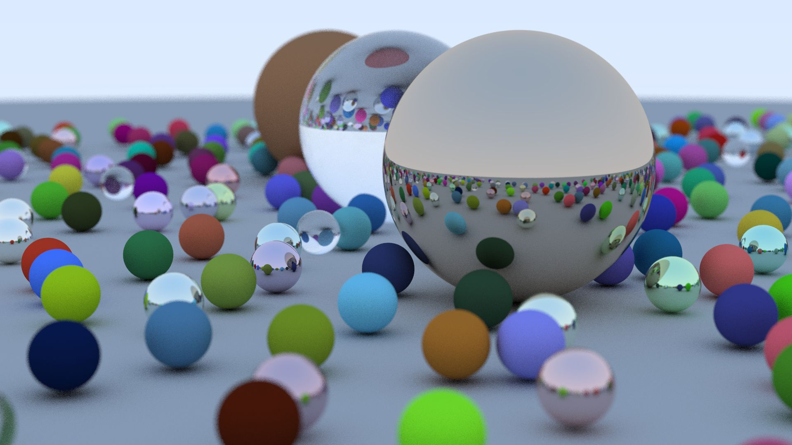

# c-path-tracer
</img>

My implementation from Peter Shirley's Ray Tracing in one Weekend book written in standard C11:
http://in1weekend.blogspot.com/2016/01/ray-tracing-in-one-weekend.html

## Features:
+ Diffuse (lambertian), metal, glass (dielectric) materials
+ Antialiasing, depth of field

